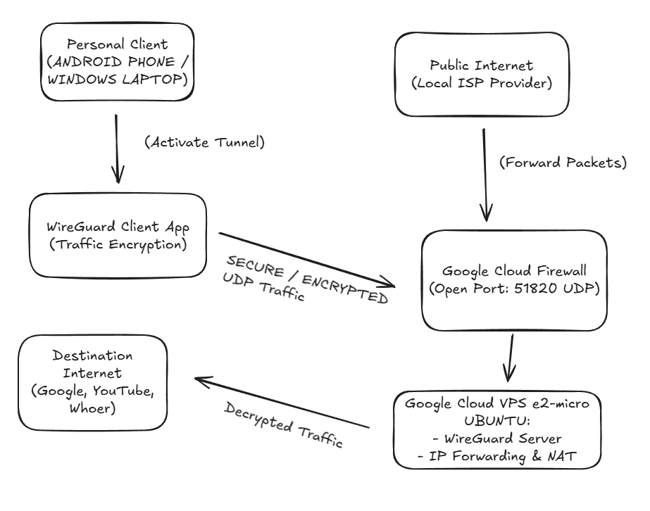
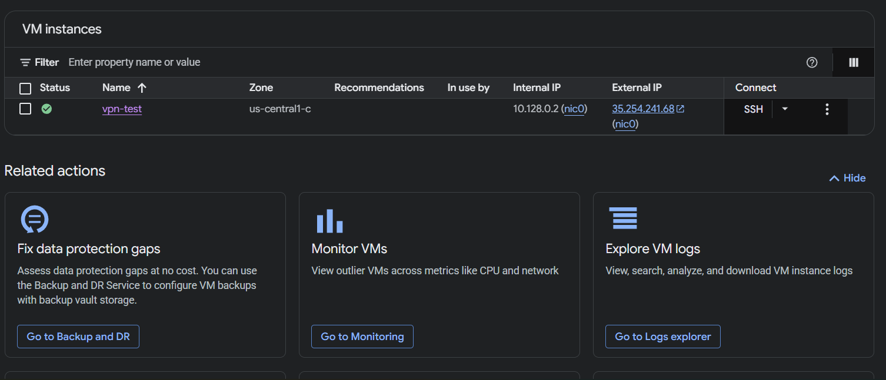
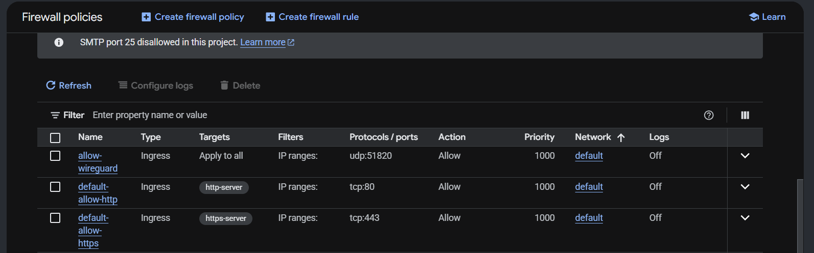
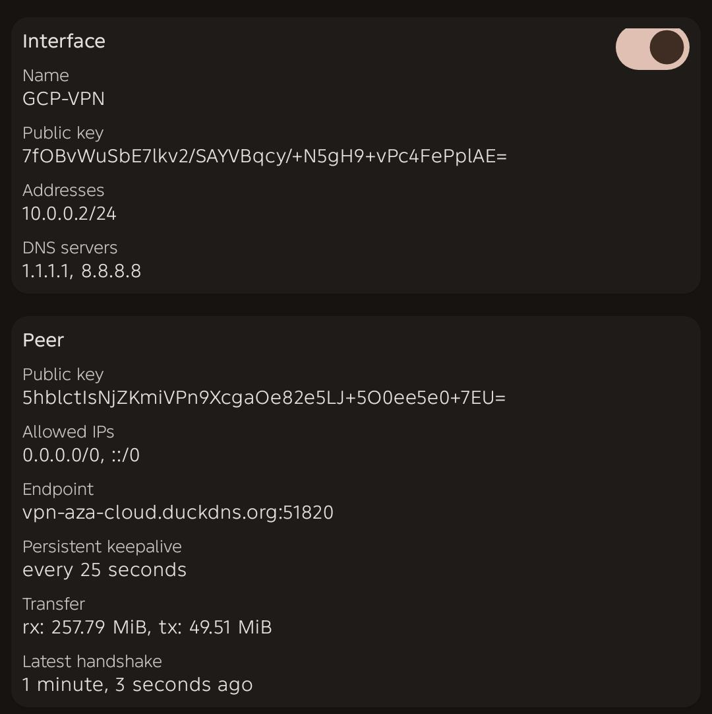
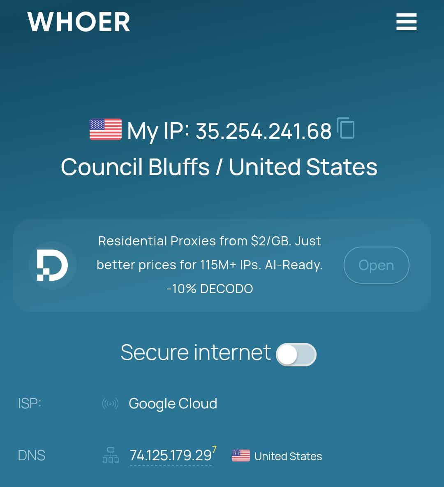

# 🌐 Self-Hosted WireGuard VPN Server on Google Cloud Platform

This repository documents the step-by-step implementation of a production-ready, self-hosted VPN server. It leverages a **Google Cloud Platform (GCP) e2-micro** instance under the *Always Free Tier*. To ensure seamless connectivity despite dynamic public IP changes, the system is integrated with **DuckDNS** as a Dynamic DNS (DDNS) solution.

## 🗺️ Network Architecture
The diagram below illustrates the flow of encrypted internet traffic from the local device to the public internet via the Google Cloud infrastructure:

*Flow Details:* `Client (Phone/Laptop) -> Encrypted Tunnel (UDP 51820) -> GCP Firewall -> Ubuntu VPS (WireGuard) -> IP Forwarding & NAT -> Public Internet`

---

## 🚀 Features & Technical Specifications
* **Cloud Platform:** Google Cloud Platform (e2-micro instance, 2 vCPUs, 1 GB RAM, US-region)
* **Server OS:** Ubuntu 22.04 LTS
* **VPN Protocol:** WireGuard (State-of-the-art cryptography)
* **Dynamic DNS:** DuckDNS with an automated cronjob script syncing the IP address every 5 minutes
* **Tunneling Type:** Full Tunnel (`AllowedIPs = 0.0.0.0/0`) – Secures and routes all data traffic

---

## 🛠️ Implementation Steps

### 1. VPS Provisioning & Hardening
* Deployed an `e2-micro` VM Instance in the `us-central1` region with a 30GB Standard Persistent boot disk.
* Promoted the public IP address from Ephemeral to Static within the VPC Network dashboard.
* Secured the local server environment using UFW (Uncomplicated Firewall).

### 2. Free Domain Integration (DuckDNS)
* Registered a custom subdomain on DuckDNS.
* Created a automation bash script (`duck.sh`) on the VPS and scheduled it via `crontab` to sync the server's public IP automatically every 5 minutes.

### 3. WireGuard Installation & Configuration
* Generated cryptographic keypairs (Public and Private Keys) independently for both the Server and the Client.
* Enabled IP Forwarding at the Linux kernel level via `/etc/sysctl.conf`.
* Configured Network Address Translation (NAT) rules using IPTables via the `PostUp` and `PostDown` hooks inside `wg0.conf`.

### 4. Client Setup & Connection
* Constructed the `client.conf` profile and converted it into a scannable QR Code using the `qrencode` utility directly in the terminal.
* Scanned the QR Code using the official WireGuard client application on an Android/iOS device.

---

## 🔍 Case Study & Troubleshooting Mindset

### Issue: "Connected" Status But No Internet Access (The "Ghost Handshake" Problem)
* **Symptoms:** When the VPN profile was toggled active on the mobile device, the application status indicated a successful connection, but all internet connectivity dropped instantly.
* **Analysis & Diagnosis:** I ran the `sudo wg show` command in the VPS terminal to monitor active tunnel traffic. The output revealed that the `latest handshake` field was completely empty and no data bytes were being `received`. This diagnosed that the UDP packets sent from the client were being blocked by the cloud security layers before ever reaching the WireGuard application daemon.
* **Resolution:** I inspected the **GCP VPC Network > Firewall** rules and confirmed that the WireGuard port was blocked by default. I created a new *Ingress Firewall Rule* to explicitly allow **UDP port 51820** from any source IP address (`0.0.0.0/0`). Once the rule was provisioned, handshakes completed within milliseconds, and internet routing was restored.

---

## 📊 Verification & Proof of Concept

Following the firewall resolution, here is the empirical proof showing the active WireGuard client status and the successful redirection of all internet traffic through Google's cloud infrastructure:

| WireGuard Client Status | IP & ISP Detection (Whoer.net) |
|---|---|
|  |  |

*The evaluation on Whoer.net clearly shows that the public ISP is detected as **Google LLC**, validating that the data encryption layer and the server-side NAT mechanism are functioning 100% perfectly.*

---

## 📂 Repository Structure
* `configs/wg0-template.conf` : Configuration template for the server environment.
* `configs/client-template.conf` : Configuration template for the client device.
*(Note: All production Private Keys have been scrubbed out and replaced with placeholders for security mitigation).*
